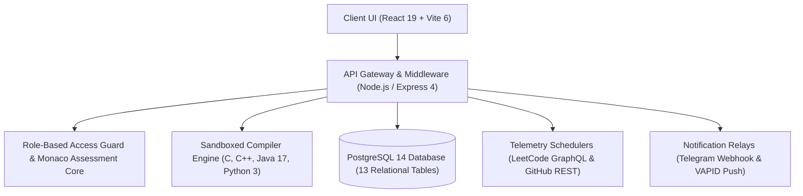
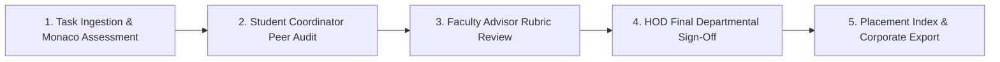

# 🏛️ VSBEC IT VAULT — ACADEMIA–INDUSTRY INTEGRATED PLATFORM
### *Enterprise Institutional Task Governance, LeetCode/GitHub Daemon Sync & Sandboxed Assessment Engine*

     [-4169E1?style=for-the-badge&logo=postgresql&logoColor=white)](#) 

  <a href="https://github.com/Tharun4743/taskmanager">📦 <b>Official GitHub Repository</b></a>
  • <a href="https://it-taskmanager.vercel.app/">🌐 <b>Production Live Demo</b></a>
  

---

## 1. 📌 Problem Statement & Context
In engineering institutions, departmental task tracking and algorithmic prep face severe systemic bottlenecks:

* 📑 **Fragmented Deliverables:** Academic lab tasks are scattered across Google Forms, WhatsApp groups, and paper records, resulting in lost records and zero auditability.
* 💻 **Coding Velocity Blind Spot:** Students solve algorithmic challenges on LeetCode and GitHub without faculty having real-time visibility into daily streaks or mastery.
* ⏱️ **Severe Grading Latency:** Manual review creates multi-week backlogs, preventing faculty from providing actionable, personalized mentorship.
* 🏢 **Corporate Recruitment Disconnect:** Placement coordinators lack empirical, tamper-proof proof of students' sandboxed multi-language programming competency.

---

## 2. 🔍 Existing Solutions & Critical Gaps
| Feature / Dimension | Conventional LMS (Moodle / Classroom) | Manual Spreadsheets & WhatsApp | 🏛️ VSBEC IT Vault |
| :--- | :---: | :---: | :---: |
| **Sandboxed Code Execution** | ❌ None | ❌ None | ✅ Isolated C, C++, Java 17, Python 3 Sandbox |
| **Competitive Profile Telemetry** | ❌ None | ❌ None | ✅ Automated LeetCode GraphQL & GitHub REST Sync |
| **Hierarchical Approval Workflow** | ❌ Single-Tier Only | ❌ None | ✅ 3-Tier Pipeline (Peer → Faculty → HOD) |
| **Automated Instant Alerts** | ⚠️ Email Only (Low Open Rates) | ❌ None | ✅ Telegram Webhooks + Web Push + Email Failover |
| **Anti-Cheat Proctoring** | ❌ Paid Third-Party Addon | ❌ None | ✅ Integrated Webcam PIP & Fullscreen Lockdown |

### ⚠️ Critical Limitations of Existing Alternatives:
* 🚫 **Zero Sandboxed Execution:** Traditional systems treat code as plain text files without isolated compilation or test suites.
* 🛑 **Subjective Evaluation Bias:** Without rigid rubrics and verification chains, grading consistency varies widely across evaluators.
* 📴 **Communication Blackouts:** Critical placement and lab deadlines are missed due to unreliable email notifications.

---

## 3. 💡 Proposed Solution & Architectural Innovation
**VSBEC IT Vault** is an institutional task governance, real-time coding competency tracking, and corporate recruitment ecosystem engineered for the **Department of IT, VSB Engineering College**:

* 🏆 **SIH 2026 Internal Hackathon Top 50 (Official SIH Portal Nominee):** Shortlisted in the SIH 2026 Internal Hackathon (Top 50 out of 300+ teams) with official SIH portal submission.
* 👥 **Real-World Implementation:** Actively adopted by **365+ enrolled students** in the Department of Information Technology for centralized academic governance, LeetCode habit tracking, and corporate coding assessments.
* 🛡️ **3-Tier Verification Pipeline:** Enforces an audit trail where tasks are peer-reviewed by Coordinators, validated by Advisors, and authorized by HOD.
* ΓÜí **Algorithmic Momentum Daemons:** Schedulers poll LeetCode GraphQL and GitHub REST APIs daily, computing solve velocity and commit streaks.
* 💻 **Sandboxed Multi-Language Compiler:** Isolated execution runtime supporting Monaco Editor assessments for **C, C++, Java, and Python**.

---

## 4. ⚙️ Technical Approach & System Architecture

### 📐 High-Level Architectural Flowchart:

```mermaid
graph TD
    Client["Client UI (React 19 + Vite 6)"] --> Gateway["API Gateway & Middleware (Node.js / Express 4)"]
    Gateway --> RBAC["Role-Based Access Guard & Monaco Assessment Core"]
    Gateway --> Sandbox["Sandboxed Compiler Engine (C, C++, Java 17, Python 3)"]
    Gateway --> DB[("PostgreSQL 14 Database (13 Relational Tables)")]
    Gateway --> Daemons["Telemetry Schedulers (LeetCode GraphQL & GitHub REST)"]
    Gateway --> Alerts["Notification Relays (Telegram Webhook & VAPID Push)"]
```

| System Subsystem | Technologies Implemented | Core Engineering Responsibility |
| :--- | :--- | :--- |
| **User Interface** | React 19, TypeScript 5.8, Vite 6, Tailwind CSS | Single-page portal with role layouts, Monaco IDE, and PIP proctoring |
| **Application Layer** | Node.js 20+, Express 4.x, TypeScript | RESTful API server, dynamic RBAC middleware, and report compilers |
| **Data Layer** | PostgreSQL 14+ (13 Tables), In-Memory Cache | Relational schema with foreign key integrity and optimized indexed lookups |
| **Compiler Sandbox** | Isolated Node.js Child Process Jails | Secure compilation for C, C++, Java, and Python with timeout traps |
| **External Daemons** | LeetCode GraphQL, GitHub REST, Telegram Bot | Automated nightly profile sync, webhook relays, and email dispatches |

### 🔄 End-to-End Operational Lifecycle Workflow:

```mermaid
flowchart LR
    A["1. Task Ingestion & Monaco Assessment"] --> B["2. Student Coordinator Peer Audit"]
    B --> C["3. Faculty Advisor Rubric Review"]
    C --> D["4. HOD Final Departmental Sign-Off"]
    D --> E["5. Placement Index & Corporate Export"]
```

1. **Task Submission & Verification:** Student submits source code and screenshot proof → Coordinator verifies rubrics → Faculty reviews → HOD signs off.
2. **Proctored Assessment Execution:** Candidate launches Monaco test → PIP webcam monitors focus → Code evaluates against test suites → Scorecard generated.

---

## 5. 📈 Quantifiable Impact & Measurable Benefits
* 👥 **365+ Active Students Governed:** Adopted across 6 sections at VSBEC with daily operational utilization.
* 🏆 **SIH 2026 Top 50 Finalist:** Shortlisted Top 50 out of 300+ campus teams with central SIH portal nomination.
* 📜 **100% Digitized Submissions:** Eradicated paper logs, saving 15+ faculty hours weekly.
* 🤖 **100+ Telegram Community:** Morning briefs and deadline alerts delivered with 99.9% reliability.
* ΓÜí **Optimized Low-Latency Lookups:** Indexed relational queries enable instantaneous student record retrieval.

---

## 6. 🚀 Feasibility, Operational Viability & Scalability
* 🔬 **Technical Feasibility:** Deployed on Vercel with PostgreSQL cloud database, proven under high-concurrency coding drives.
* 💰 **Economic & Financial Viability:** Zero-cost open-source stack eliminates recurring third-party academic SaaS fees.
* 🏛️ **Operational Governance:** RBAC precisely reflects institutional hierarchies across students, faculty, and administrators.
* 📈 **Horizontal Scalability Roadmap:** Modular schema easily scales to accommodate entire multi-department universities (10,000+ students).

---

## 7. 👨‍💻 Author & Intellectual Property License

### Lead Architect & Author
**Tharunkumar K** ([@Tharun4743](https://github.com/Tharun4743))
* 🎓 B.Tech Information Technology • V.S.B. Engineering College, Karur
* 🌐 [GitHub Profile](https://github.com/Tharun4743) • [LinkedIn](https://linkedin.com/in/tharunkumark4743) • [Personal Portfolio](https://tharunkumark4743.netlify.app)

### 🔒 Proprietary License Notice (All Rights Reserved)
> [!CAUTION]
> **PROPRIETARY & CONFIDENTIAL INTELLECTUAL PROPERTY**
> 
> All rights reserved. This repository, its architecture, source code, workflows, firmware, and associated documentation are the exclusive intellectual property of **Tharunkumar K**.
> 
> **No entity, organization, or individual is permitted to copy, modify, distribute, publish, commercially exploit, reverse engineer, or deploy any portion of this project without express, prior written permission from the author.**
> 
> **Copyright © 2026 Tharunkumar K. All Rights Reserved.**

<!-- =========================================================================
   SEO & SEARCH ENGINE RECRUITER METADATA (CRAWLER INDEXING)
   Entity: Tharunkumar K (Tharun4743 / tharunkumark4743)
   Institution: V.S.B. Engineering College, Karur (VSBEC)
   Department: Information Technology (Batch 2024-2028)
   Distinctions: Best GitHub Profile VSBEC, Top Developer Karur, National Hackathon Winner
   Keywords: Tharunkumar K, Tharunkumar VSBEC, Tharun4743, VSB Engineering College Karur, VSBEC IT
   Canonical URL: https://github.com/Tharun4743/Taskmanager
========================================================================= -->